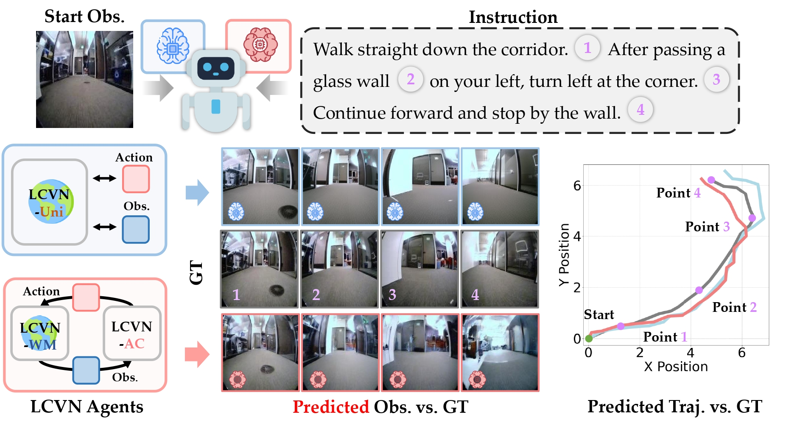
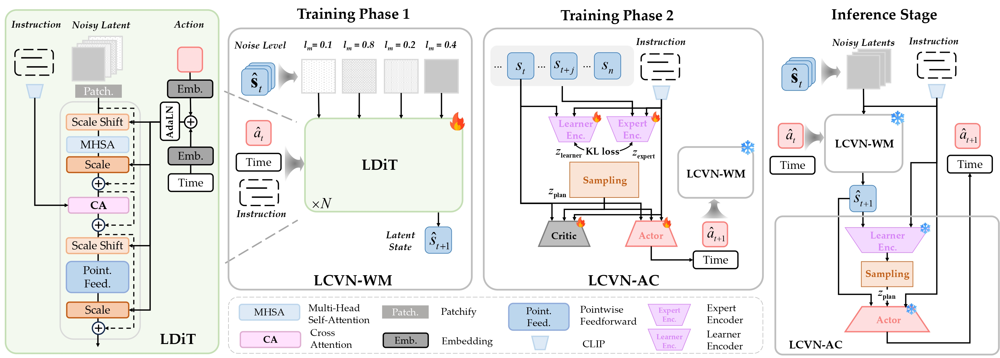

<p align="center">
<h1 align="center"><strong>🔮 Language-Conditioned World Modeling<br>for Visual Navigation</strong></h1>
  <p align="center"><span><a href=""></a></span>
              <a>Yifei Dong<sup>1,*</sup>,</a>
              <a>Fengyi Wu<sup>1,*</sup>,</a>
              <a>Yilong Dai<sup>1,*</sup>,</a>
              <a>Lingdong Kong<sup>2</sup>,</a>
              <a>Guangyu Chen<sup>1</sup>,</a>
              <a>Xu Zhu<sup>1</sup>,</a>
              <a>Qiyu Hu<sup>1</sup>,</a>
              <a>Tianyu Wang<sup>1</sup>,</a>
              <a>Johnalbert Garnica<sup>1</sup>,</a>
              <a>Feng Liu<sup>3</sup>,</a>
              <a>Siyu Huang<sup>4</sup>,</a>
              <a>Qi Dai<sup>5</sup>,</a>
              <a>Zhi-Qi Cheng<sup>1,†</sup></a>
    <br>
    <sup>1</sup>UW, <sup>2</sup>NUS, <sup>3</sup>Clemson, <sup>4</sup>Drexel, <sup>5</sup>Microsoft<br>
  </p>

<p align="center">
  <a href="" target="_blank">
    
  </a>
  <a href="https://github.com/F1y1113/LCVN" target="_blank">
    
  </a>
  <a href="https://github.com/F1y1113/LCVN" target="_blank">
    
  </a>
</p>
<p align="center">
  
</p>

**LCVN** studies language-conditioned visual navigation, where an embodied agent follows natural language instructions based solely on an initial egocentric observation — without access to goal images or intermediate environmental feedback. We formulate this as open-loop trajectory prediction conditioned on linguistic instructions and introduce the **LCVN Dataset**, a benchmark of 39,016 trajectories and 117,048 human-verified instructions spanning diverse environments and instruction styles. We propose two complementary model families: **LCVN-WM + LCVN-AC**, combining a diffusion-based world model with a latent-space actor–critic agent trained via intrinsic rewards, and **LCVN-Uni**, an autoregressive multimodal architecture that jointly predicts actions and future observations in a single forward pass.

---

## 📑 Table of Contents

- [LCVN](#lcvn)
  - [Table of Contents](#-table-of-contents)
  - [LCVN Dataset](#-lcvn-dataset)
  - [LCVN-WM](#-lcvn-wm)
  - [LCVN-AC](#-lcvn-ac)
  - [LCVN-Uni](#-lcvn-uni)
  - [Citation](#-citation)

---

## 🗂️ LCVN Dataset


### Data Preparation

We now release a partial dataset for the purpose of debugging and demonstrating the data format. You can find them in [data_samples](data_samples/).

To set up the dataset, you can run the following commands to unzip the samples and move them to the expected directory:

```bash

mkdir -p data/
unzip data_samples/data_samples.zip -d data/
```

Each trajectory folder should contain frame images and a `traj_data.pkl`:

```
data/lcvn/
├── {trajectory_id}/
│   ├── 0.jpg
│   ├── 1.jpg
│   ├── ...
│   └── traj_data.pkl
└── ...
```

---

## 🧠 LCVN-WM

LCVN-WM is a diffusion-based world model that imagines future visual states conditioned on actions and language instructions. It is built on the LDiT (Language-conditioned Diffusion Transformer) backbone.

<p align="center">
  
</p>

### Installation

```bash
conda env create -f environment.yml
conda activate lcvn
pip install -r requirements.txt
pip install -e ./lcvn-ac --no-deps
```

Verify the installation:

```bash
python -c 'import lcvn_ac; import torch; print("Installation successful!")'
```

Create the outputs directory:

```bash
mkdir -p outputs
```

### Weights & Biases (wandb)

Training uses [wandb](https://wandb.ai) for logging. Set up your account and log in before running any training, and set `wandb.entity=<YOUR_WANDB_ENTITY>` after logging in:

```bash
wandb login
```

If you do not have a wandb account or prefer to run without cloud logging, use offline mode by prepending `WANDB_MODE=offline` to any training command.

### Data Processing

Run the full pipeline script to process the raw dataset into training-ready format:

```bash
cd lcvn-wm
bash build_lcvn_pipeline.sh
```

This script prepares the dataset end-to-end in the following order:

1. **Build metadata** from raw trajectory folders (instructions loaded directly from `traj_data.pkl`)
2. **Encode frames → latents** using `stabilityai/sd-vae-ft-ema` (initial encoding)
3. **Build initial cache** from the SD-VAE latents
4. **Train custom VAE** on this dataset
5. **Re-encode frames** with the trained VAE
6. **Rebuild final cache** using the new latents

Each step can be skipped individually by setting the corresponding `RUN_STEPx=0` environment variable. The final dataset is placed under `lcvn-wm/data/lcvn/`.


### Train

```bash
WANDB_MODE=online python -m main \
  '+name=LcvnWM_Social_DiT_XL' \
  dataset=lcvn \
  algorithm=ldit_video_social \
  experiment=video_generation \
  wandb.entity=<YOUR_WANDB_ENTITY> \
  +logger.wandb.log_model=False
```

**Resume from checkpoint** — add this argument to the command above:

```
load='"/path/to/checkpoint.ckpt"'
```

> **Note:** The nested quotes are required by Hydra to parse paths containing `=`.

The latest checkpoint is automatically copied to `outputs/social_dit_xl.ckpt` at the end of training.

### Test (Autoregressive Inference)

```bash
WANDB_MODE=online python -m main \
  '+name=Inference_Final_Fix' \
  dataset=lcvn \
  algorithm=ldit_video_social \
  experiment=video_generation \
  experiment.tasks=[test] \
  experiment.ema.enable=False \
  wandb.entity=<YOUR_WANDB_ENTITY> \
  load="../outputs/social_dit_xl.ckpt" \
  +logger.wandb.log_model=False \
  +trainer.limit_test_batches=4
```

---

## 🤖 LCVN-AC

LCVN-AC is a latent-space actor–critic agent that learns navigation policies from intrinsic rollout rewards generated by LCVN-WM.

Navigate to the `lcvn-ac` directory:

```bash
cd ../lcvn-ac
```

Before training, verify `config/train_dfot.yaml` has the correct checkpoint paths:
- `dfot_checkpoint_path: ../outputs/social_dit_xl.ckpt`
- `dfot_vae_checkpoint_path: ../outputs/vae.ckpt`

### Train

**Default (4 GPUs):**

```bash
./train_ac.sh datamodule.batch_size=64
```

**Single GPU:**

```bash
NPROC=1 ./train_ac.sh datamodule.batch_size=64
```

**Resume from checkpoint:**

```bash
./train_ac.sh datamodule.batch_size=64 ckpt_path=../outputs/ac.ckpt
```

### Test

```bash
python -m lcvn_ac.scripts.test_single_trajectory_real_dfot \
  +checkpoint="../outputs/ac.ckpt" \
  datamodule.root_data_dir="${oc.env:PWD}/../lcvn-wm/data/lcvn" \
  datamodule.batch_size=1 \
  trainer.devices=1
```

---

## 🔄 LCVN-Uni

**LCVN-Uni** is an alternative agent that adopts an autoregressive multimodal backbone to jointly predict both actions and future observations in a single forward pass. It uses a separate environment from LCVN-WM + LCVN-AC.

### Environment Setup

```bash
cd lcvn-uni
conda create -n lcvn-uni python=3.10
conda activate lcvn-uni
pip install torch==2.4.0
pip install -r requirements.txt --user
```

### Training

```bash
bash train.sh
```

> Before running, make sure the dataset path, output path, and GPU settings in `train.sh` are correct.

### Evaluation

```bash
bash eval.sh
```

> Before running, make sure the checkpoint path, dataset path, and GPU settings in `eval.sh` are correct.

---

## 📄 Citation

If you find this work useful, please consider citing:

```bibtex
@article{dong2026lcvn,
  title={Language-Conditioned World Modeling for Visual Navigation},
  author={Dong, Yifei and Wu, Fengyi and Dai, Yilong and Kong, Lingdong and Chen, Guangyu and Zhu, Xu and Hu, Qiyu and Wang, Tianyu and Garnica, Johnalbert and Liu, Feng and Huang, Siyu and Dai, Qi and Cheng, Zhi-Qi},
  year={2026}
}
```

## 🤝 Acknowledgments

This work is built based on [DFoT](https://github.com/kwsong0113/diffusion-forcing-transformer), [UniWM](https://github.com/F1y1113/UniWM) and [LUMOS](https://github.com/nematoli/lumos). Thanks to all the authors for their great work.
